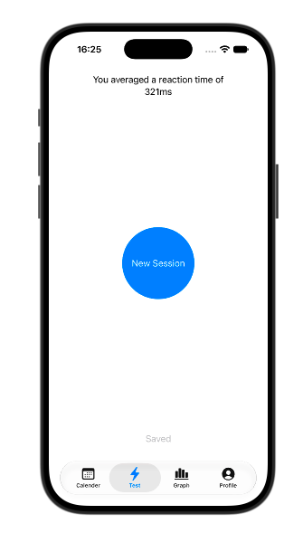
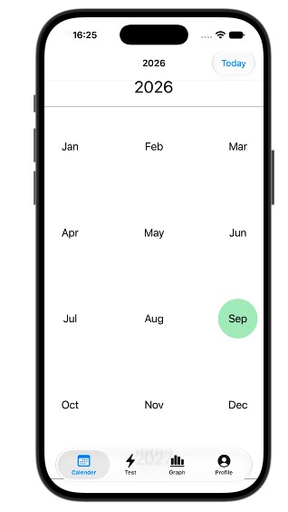
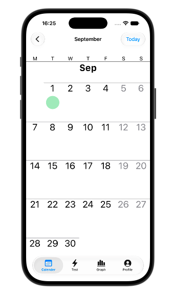
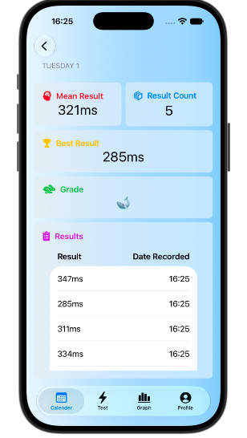
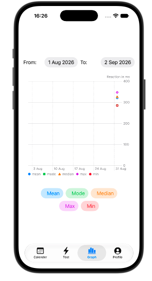

# Reaction Time App

An iOS app for measuring visual reaction time and tracking it over time. Built in Swift and SwiftUI.

A session is five taps: wait for the screen to change, tap as fast as you can, and the app records the interval. Results are averaged, graded, and saved to the device, so you can look back at how a single day went or how the last month trended.

## Screenshots

| Test | Calendar (year) | Calendar (month) |
|---|---|---|
|  |  |  |

| Day detail | Graph |
|---|---|
|  |  |

## Features

- **Five-attempt test sessions** with a randomised wait (0.4–7.0s) before each prompt, so the timing can't be anticipated.
- **False start detection** — tapping before the prompt appears voids the attempt and restarts it, keeping the results already banked in that session.
- **Session average** calculated at the end of the five attempts, with the option to save the whole session to your history.
- **Animal grading** — each time maps to an animal from a housefly down to a rock.
- **Calendar history** that goes from year, to month, to a single day's results, with day and month cells shaded by how many attempts were recorded.
- **Graph view** over a chosen date range, plotting mean, mode, median, max and min as individually toggle-able series.
- **Local profile** — username and profile image stored on device.

## How the timing works

The test sits in a small state machine (`timerState`) that moves through `dormant → waitingRandomTime → waitingForUser → dormant`, and into `falseStart` or `endOfSession` where appropriate.

When a test starts, `TestSession` schedules a `Timer` for a random interval. When it fires, the state flips to `waitingForUser` and the moment is stamped with `Date.now`. The user's tap calls `Date().timeIntervalSince(testStartTime)`, and that interval is the recorded result.

This measures the time from the state change to the tap being handled. It is a consistent, comparable number between sessions on the same device, but it does include screen refresh and touch sampling latency, so it isn't directly comparable to laboratory measurements or to results from other hardware.

## Architecture

The app follows an MVC split, with SwiftUI's `@Observable` macro driving view updates.

- **Model** — plain Swift types holding the rules and the data. `TestSession` owns the state machine and the timing; `TestLogic` wraps a session and tracks progress through the five attempts; `Result` defines a single recorded time; `ResultStore` owns the collection of results and all persistence and filtering.
- **Controller** — a single `@Observable Controller` that the views talk to. It exposes read-only computed properties for the current state and forwards user actions into the model. Views never touch `TestSession` or `ResultStore` directly.
- **View** — SwiftUI views for the four tabs (Calendar, Test, Graph, Profile), reading state from the controller.

## Persistence

Results are stored as JSON in the app's documents directory. `ResultStore.results` has a `didSet` observer that writes to disk on every mutation, so adding or deleting a result persists immediately without an explicit save step. The store is loaded from the same file on init.

Three files are used:

| File | Contents |
|---|---|
| `ReactionResultsStore` | Encoded `[Result]` |
| `ReactionResultsUsername` | Encoded username string |
| `ReactionResultsImage` | Profile image as JPEG data |

Filtering for the calendar and graph views (by day, week, month and year) is handled in `ResultStore` rather than in the views.

## Project structure

```
ReactionTimeApp/
├── Model/
│   ├── TestComponents/
│   │   ├── TestSession.swift      # State machine, timing, session results
│   │   └── TestLogic.swift        # Session progress and button handling
│   └── ResultStorageComponents/
│       ├── Result.swift           # A single recorded time + grading
│       └── ResultStore.swift      # Storage, loading, filtering
├── Controller/
│   └── Controller.swift           # Single entry point for the views
└── View/                          # SwiftUI views for the four tabs
```

## Requirements

- iOS 17.0 or later (uses the `@Observable` macro)
- Xcode 15 or later
- Swift 5.9 or later

## Getting started

```bash
git clone https://github.com/tobyweir/ReactionTimeApp.git
cd ReactionTimeApp
open ReactionTimeApp.xcodeproj
```

Select a simulator or a connected device and run. There are no third-party dependencies and no configuration to set up.

For real measurements, run on a device rather than the simulator — simulator input latency is not representative.
